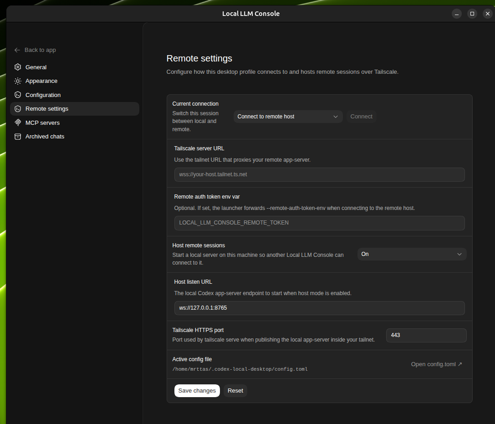
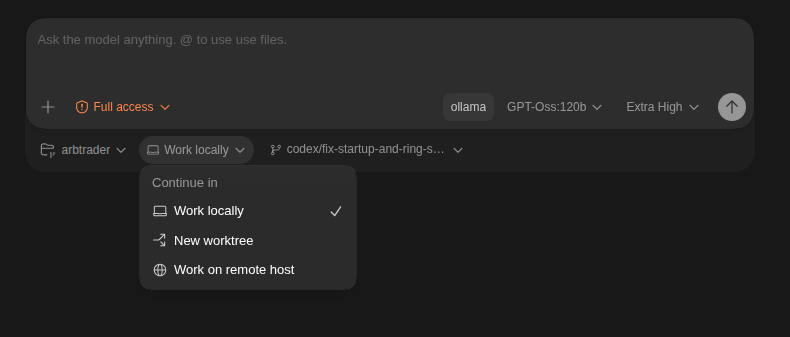

# Local LLM Console

Local LLM Console is a standalone desktop app for local LLMs with a Codex Desktop like UI, Tailscale-based remote host support, and self-contained Linux and macOS distro builders.

This repository includes the Local LLM Console launchers, patched webview, desktop integration files, icon assets, an X11 title fix, a local model catalog, and the scripts needed to generate `codex-app/` locally from upstream assets.

## What This Repo Is

- A Codex Desktop app fork layer for local models
- A portable copy of the Local LLM Console launchers and UI patches
- A local-model catalog and desktop launcher/icon bundle
- A remote-host workflow for connecting one Local LLM Console session to another over Tailscale
- A self-bootstrapping installer that generates the Linux app locally
- A macOS distro builder that outputs a standalone `.app` bundle and zip

## What This Repo Is Not

- Not an OpenAI-hosted Codex cloud client

## Included

- `codex-app/start-local.sh`
  Local launcher that rebuilds and runs the Local LLM Console runtime against the generated local app runtime
- `codex-app/.codex-linux/local-ai-console-x11-title-fix.sh`
  X11 window-title fix for the branded local app window
- `launcher/codex-local-desktop-cli`
  Local Codex CLI wrapper configured for Ollama
- `launcher/local-ai-console-launch`
  User-facing launcher entry point
- `launcher/local-ai-console-host-service`
  Helper that starts and reloads the local host-side remote session service
- `launcher/local-ai-console-webview-server.py`
  Local control server that serves the patched webview and session state endpoints
- `desktop/local-ai-console.desktop`
  Desktop entry template
- `assets/local-ai-console-gradient.png`
  Local app icon
- `config/local-model-catalog.json`
  Local model catalog used by the app
- `install.sh`
  Standalone Linux installer that builds `codex-app/` locally and bundles the Codex runtime
- `scripts/build-macos-dist.sh`
  macOS distro builder that creates an unsigned `Local LLM Console.app` zip with the Codex runtime bundled inside
- `scripts/`
  Builder support scripts used by the installer
- `webview/`
  The patched Local LLM Console webview snapshot

## Usage

Install dependencies if needed:

```bash
bash scripts/install-deps.sh
```

Build the Linux app:

```bash
./install.sh
```

The generated Linux app includes its own bundled Codex runtime. A separate host `codex` install is not required.

Launch it:

```bash
./launcher/local-ai-console-launch
```

If you already have a local `Codex.dmg`, you can point the installer at it:

```bash
./install.sh /path/to/Codex.dmg
```

Build the macOS distro:

```bash
./scripts/build-macos-dist.sh
```

That creates:

- `dist/macos/Local LLM Console.app`
- `dist/macos/Local-LLM-Console-macos-unsigned.zip`

The macOS distro also bundles the Codex runtime inside the app. It does not require a separate host `codex` install.

## Distro Output

- Linux:
  Run `./install.sh`, then launch with `./launcher/local-ai-console-launch`
- macOS:
  Run `./scripts/build-macos-dist.sh`, then use `dist/macos/Local LLM Console.app` or `dist/macos/Local-LLM-Console-macos-unsigned.zip`

## macOS Notes

- The macOS build is currently unsigned.
- On first launch, macOS may require `Right click -> Open` or quarantine removal before the app will run.

## Optional Local Setup

Put the launcher on your `PATH`:

```bash
ln -sf "$PWD/launcher/local-ai-console-launch" ~/.local/bin/local-ai-console-launch
ln -sf "$PWD/launcher/codex-local-desktop-cli" ~/.local/bin/codex-local-desktop-cli
```

Install the desktop file:

```bash
cp desktop/local-ai-console.desktop ~/.local/share/applications/
```

The desktop file expects `local-ai-console-launch` to be available on `PATH`, and it assumes you have already run `./install.sh`.

## Models

The included local model catalog is configured for local Ollama models.

The generated app uses the local CLI wrapper for Ollama:

```bash
codex --disable plugins -c 'model_provider="ollama"'
```

## Remote Host Sessions

Local LLM Console can host and connect to remote sessions over Tailscale.

Host machine flow:

1. Open `Settings` -> `Remote settings`.
2. Turn on `Host remote sessions`.
3. Keep or adjust the local listen URL and Tailscale HTTPS port.
4. Save changes.

Client machine flow:

1. Open `Settings` -> `Remote settings`.
2. Enter the remote machine's Tailscale `wss://...` URL.
3. Save changes.
4. Use `Current connection` -> `Connect to remote host`, or switch from the chat picker.

Remote settings UI:



Chat picker remote-host action:



## Notes

- This repo intentionally contains the Local LLM Console layer plus the builder needed to generate its own local app runtime.
- It builds its own `codex-app/` locally instead of requiring a preinstalled base app.
- The regular cloud Codex Desktop app is out of scope here.
